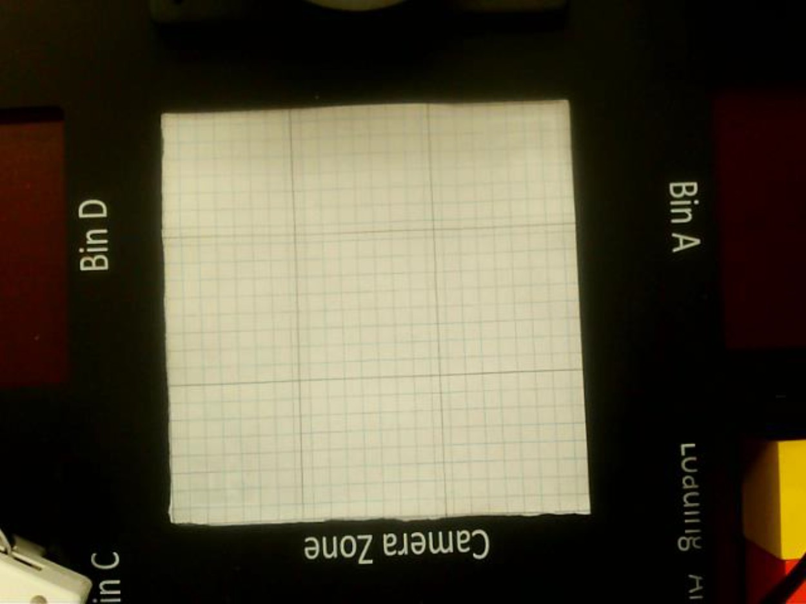
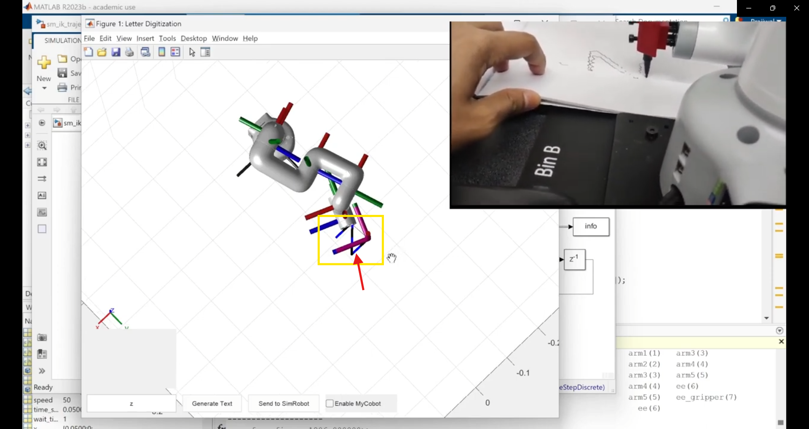

# Using MyCobot Collaborative Manipulator for Pick-and-Place and Arm Movement Applications

This repository contains two related robotics demonstrations built around the Elephant Robotics myCobot 280M5. The first is a tic-tac-toe-playing robot that uses computer vision and color recognition to play against a human user. The second is a digital twin workflow in MATLAB that traces letters in simulation and on the real robot at the same time, including the final synchronized writing of the letter Z.

The repository was used as a lab-style robotics report, so this README is written as a project report rather than a quick-start guide.

## Abstract

This project uses computer vision, robotics, and color recognition to build an interactive myCobot 280M5 system for human-robot collaboration. In the tic-tac-toe portion of the project, the robot observes a board, detects colored blocks, interprets the game state, and makes strategic moves. In the digital twin portion, MATLAB and Simulink are used to generate joint trajectories for writing letters in both simulation and physical hardware.

The overall aim is to demonstrate that a low-cost robotic arm can be used not only for motion execution, but also for perception-driven gameplay and synchronized digital-twin motion.

## Introduction

The project combines computer vision, serial communication, inverse kinematics, and robot motion planning into one human-facing interaction system. The tic-tac-toe system uses a camera, ArUco markers, and color block recognition to map the board state. The digital twin system uses MATLAB, a URDF-based robot model, and a Simulink trajectory model to stream joint angles to the real robot while reproducing the same motion in simulation.

The project is intended to be both technically useful and visually engaging. It shows how robotic arms can participate in simple recreational tasks, and how the same hardware can be reused for a second demonstration that writes letters such as Z in a synchronized simulation-plus-hardware workflow.

## Objectives

1. Build a camera-based recognition pipeline for tic-tac-toe blocks.
2. Use game logic, including alpha-beta search, so the robot can choose a strong move.
3. Provide a simple interface for live user interaction.
4. Build a MATLAB digital twin that can generate and execute letter-writing trajectories.
5. Demonstrate synchronized motion in both simulation and real hardware.

## Hardware and Software

### Tic-Tac-Toe Robot Setup

- myCobot 280M5
- End effector: single head suction pump
- USB camera
- ArUco markers

### Digital Twin Setup

- MATLAB
- Simulink
- Robotics System Toolbox
- URDF-based myCobot model
- Serial communication to the physical robot

## Tic-Tac-Toe Robot

### Methodology

The tic-tac-toe workflow begins by adjusting the camera so that it covers the entire recognition area. The board is arranged as a 3 by 3 grid and viewed in an eye-to-hand configuration. The camera feed is then used to detect the position and color of game blocks.

The board calibration setup is shown below.

The empty play area is shown below.

The report also includes sample board states with placed cubes.

The color recognition pipeline identifies the hue of each detected block and uses pixel-to-real coordinate conversion together with the ArUco references to map the detected block to the correct board cell. In the reported setup, blue is mapped to the user’s X move and green is mapped to the robot’s O move.

Once the board state is known, the game logic evaluates the available moves and chooses the robot’s response. The implementation includes alpha-beta based decision making so the robot aims to play strategically rather than randomly.

### Results

The result is a playable tic-tac-toe system in which the robot can observe the board, classify the colored pieces, and respond with an intelligent move. The project demonstrates that the robot can remain competitive even when it moves second.

The gameplay demo is shown below.

### User Interface

The system is designed to be simple to operate. The user runs the main execution script, follows the terminal instructions, and places colored blocks on the board. The camera stream and robot motion provide immediate feedback during the game.

### Video Reference

The project video is listed in [Video Link.txt](Video%20Link.txt), and the report also references the following demo link:

https://youtu.be/Wk0kXTqNdao

## Digital Twin Letter Writing

The repository also contains a second robotics demonstration based on MATLAB and Simulink. This part of the project generates joint trajectories for the myCobot and streams the same angles to both the simulation model and the physical robot.

The workflow is centered on a MATLAB interface that accepts a letter, converts the requested shape into waypoints, runs the inverse-kinematics model in Simulink, and sends the resulting joint angles over serial.

### Methodology

The letter-writing workflow uses a URDF robot model and a Simulink inverse-kinematics trajectory model. The motion is computed in MATLAB, displayed in the digital twin, and then transmitted to the real robot through the serial protocol.

The project includes joint-angle transfer and simulation synchronization figures.

The final demonstration writes the letter Z in both simulation and hardware at the same time.

### Results

The digital twin demo proves that the same trajectory can be visualized in MATLAB and executed on the physical myCobot with synchronized motion. This is the most direct demonstration in the repository of the digital twin concept.

The alphabet-writing demo is shown below.

## Repository Structure

- [Tic_Tac_Toe_Execute.py](Tic_Tac_Toe_Execute.py) is the main entry point for the tic-tac-toe robot workflow.
- [Tic Tac Toe/](Tic%20Tac%20Toe/) contains the computer vision, game logic, and robot control scripts.
- [Tic_Tac_Toe using keyboard/](Tic_Tac_Toe%20using%20keyboard/) contains keyboard-based and helper versions of the tic-tac-toe logic.
- [images/](images/) contains the screenshots, figures, and GIFs used in this report.

## Discussion

The project is built around human-robot interaction. In the tic-tac-toe demo, the user interacts with the robot through colored blocks, a camera, and a board layout. In the digital twin demo, the user interacts through MATLAB and observes how the same motion appears in both simulation and the physical arm.

Both demonstrations use the myCobot 280M5 as the main hardware platform, but they emphasize different capabilities. The tic-tac-toe project emphasizes perception and decision making. The digital twin project emphasizes motion planning, inverse kinematics, and synchronization between virtual and real environments.

## Conclusion

This repository shows how one robotic platform can support two different but complementary demonstrations. The tic-tac-toe system highlights computer vision, board understanding, and strategic gameplay. The digital twin system highlights synchronized letter writing, simulation, and real-robot execution. Together, they demonstrate practical human-robot interaction using the myCobot 280M5.

## Notes

- The report text in the PDF describes a lab-style implementation using a Linux machine, a USB camera, ArUco markers, and a serial connection to the robot.
- The tic-tac-toe demo uses blue for the user’s X move and green for the robot’s O move.
- The digital twin demo concludes with the synchronized Z-writing motion.
